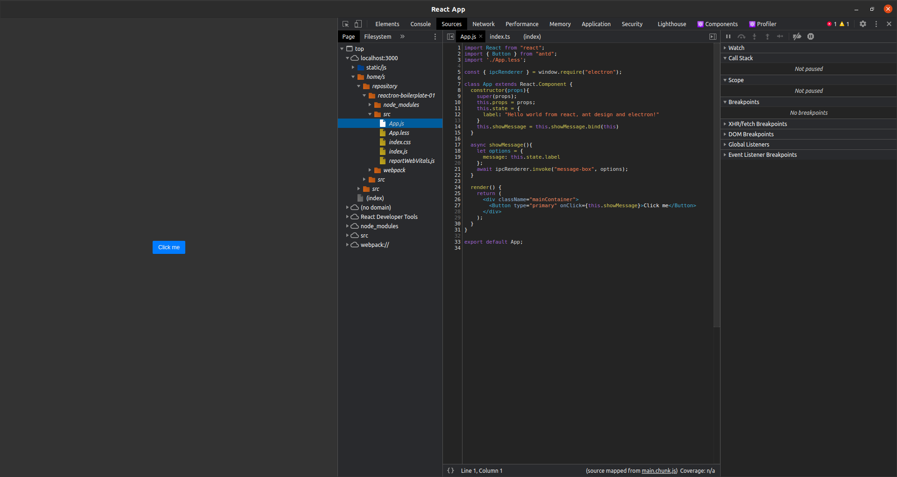

# Reactron. Essential react/electron boilerplate

## Features

- Design: [ant design](https://ant.design/)
- [CRACO](https://github.com/gsoft-inc/craco). Used to change the default theme configuaration. See also `craco.config.js`
- [Electron](https://www.electronjs.org/). Used to build cross-platform desktop app
- Configured debugger for both renderer process and main process
- Prevent multiple application instance 

## Installation

You may need `yarn`, another package manager as `npm`. If you have already installed `npm` type:
```bash
npm i yarn -g 
```
Then, install node_modules:
```bash
yarn install
```

## Usage

To start electron app launch:
```bash
yarn electron:serve
```
To build app for current os:
```bash
yarn electron:build
```

## Debug

### Main Process

First start only the renderer process throw:

```bash
yarn start
```
Then you can click `Run & Debug` in VS code and add to your launch.json following configuration:

```json
{
  "version": "0.2.0",
  "configurations": [
    {
      "name": "Debug Main Process",
      "type": "node",
      "request": "launch",
      "cwd": "${workspaceFolder}",
      "runtimeExecutable": "${workspaceFolder}/node_modules/.bin/electron",
      "windows": {
        "runtimeExecutable": "${workspaceFolder}/node_modules/.bin/electron.cmd"
      },
      "args" : ["."],
      "outputCapture": "std"
    }
  ]
}
```

### Renderer Process

For debugging the renderer process i used [electron-devtools](https://www.npmjs.com/package/electron-devtools-installer). Every time you launch the application through electron in developer mode, you will find an extension enabled to facilitate debugging with react



## Some details about Electron

Look at `electronMain.js`

```javascript
const { app, BrowserWindow, ipcMain, dialog } = require("electron");
const path = require("path");
const isDev = require("electron-is-dev");
let mainWindow = null;
const gotTheLock = app.requestSingleInstanceLock()

const showMessageBox = (options) => {
  let __options = {
    buttons: options.buttons || ["ok"],
    message: options.message || "?",
    title: options.title || "Info",
    type: options.type || "question",
  };
  return dialog.showMessageBoxSync(mainWindow, __options);
}

ipcMain.handle("message-box", async (event, options) => {
  showMessageBox(options)
});

if (!gotTheLock) {
  app.quit();
} else {
  app.on('second-instance', (event, commandLine, workingDirectory) => {
    // Someone tried to run a second instance, we should focus our window.
    if (mainWindow) {
      if (mainWindow.isMinimized()) myWindow.restore()
      mainWindow.focus()
    }
  })

  // Create myWindow, load the rest of the app, etc...
  app.on('ready', createWindow)

  // Quit when all windows are closed.
  app.on('window-all-closed', function () {
    // On OS X it is common for applications and their menu bar
    // to stay active until the user quits explicitly with Cmd + Q
    if (process.platform !== 'darwin') {
      app.quit()
    }
  })

  app.on('activate', function () {
    // On OS X it's common to re-create a window in the app when the
    // dock icon is clicked and there are no other windows open.
    if (BrowserWindow.getAllWindows().length === 0) createWindow()
  })
}

function createWindow() {
  mainWindow = new BrowserWindow({
    minWidth: 600,
    minHeight: 400,
    show: true,
    title: "Example",
    webPreferences: {
      nodeIntegration: true,
      enableRemoteModule: true,
      contextIsolation: false,
    },
  });
  const startURL = isDev
    ? "http://localhost:3000"
    : `file://${path.join(__dirname, "../build/index.html")}`;

  mainWindow.loadURL(startURL);

  mainWindow.once("ready-to-show", () => {
    mainWindow.show();
    if(isDev){
      mainWindow.toggleDevTools()
    }
  });
  mainWindow.on("closed", () => {
    mainWindow = null;
  });
  mainWindow.removeMenu();

  if (isDev) {
    const { default: installExtension, REACT_DEVELOPER_TOOLS } = require('electron-devtools-installer');
    installExtension(REACT_DEVELOPER_TOOLS)
    .then((name) => console.log(`Added Extension:  ${name}`))
    .catch((err) => console.log('An error occurred: ', err));
  }
}
```

### Create window

To create a simple window in Electron. See [here](https://www.electronjs.org/docs/latest/api/browser-window)

```javascript
const { app, BrowserWindow } = require("electron");
const isDev = require("electron-is-dev");

function createWindow() {
  mainWindow = new BrowserWindow({
    minWidth: 600,
    minHeight: 400,
    show: true,
    title: "Example",
    webPreferences: {
      nodeIntegration: true,
      enableRemoteModule: true,
      contextIsolation: false,
    },
  });
  const startURL = isDev
    ? "http://localhost:3000"
    : `file://${path.join(__dirname, "../build/index.html")}`;

  mainWindow.loadURL(startURL);

  mainWindow.once("ready-to-show", () => {
    mainWindow.show();
  });
  mainWindow.on("closed", () => {
    mainWindow = null;
  });
  mainWindow.removeMenu();
}

app.on('ready', createWindow)
```

### Prevent multiple instance

To prevent multiple application instance in electron you can use `app.requestSingleInstanceLock()`, see [here](https://www.electronjs.org/docs/latest/api/app#apprequestsingleinstancelock)

The code is:

```javascript
const { app } = require("electron");

let mainWindow = null;
const gotTheLock = app.requestSingleInstanceLock()

if (!gotTheLock) {
  app.quit();
} else {
  app.on('second-instance', (event, commandLine, workingDirectory) => {
    // Someone tried to run a second instance, we should focus our window.
    if (mainWindow) {
      if (mainWindow.isMinimized()) myWindow.restore()
      mainWindow.focus()
    }
  })

  //... to be continued

}
```

### Debug renderer process with electron-devtools-installer

```javascript
const isDev = require("electron-is-dev");

function createWindow() {

  // ... to be continued

  if (isDev) {
    const { default: installExtension, REACT_DEVELOPER_TOOLS } = require('electron-devtools-installer');
    installExtension(REACT_DEVELOPER_TOOLS)
    .then((name) => console.log(`Added Extension:  ${name}`))
    .catch((err) => console.log('An error occurred: ', err));
  }
}
```
